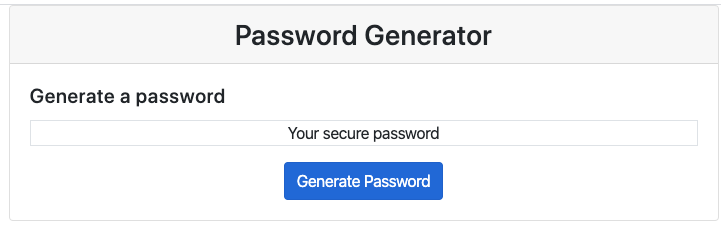

# secure-password-generator

Secure password generator generates a random password given user inputs. User determines password length between 8 and 128 characters and choses at least one type of character: lowercase, uppercase, numeric and/or special. Javascript program validates input, generates a random password and displays on the screen. User can generate a new password without leaving the webpage.

## UI of Program

